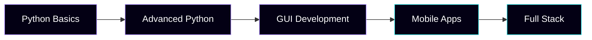

<div align="center">
  
# 👋 Emmanuel Ngwenyama


<br/>


</div>

---

## 🚀 About Me

```python
class Developer:
    def __init__(self):
        self.name = "Emmanuel Ngwenyama"
        self.brand = "Emnex"
        self.location = "Zambia 🇿🇲"
        self.skills = ["Design", "Code", "Problem Solving"]
        self.passion = "Building tools that make a difference"
        
    def current_focus(self):
        return ["Python Mastery", "Mobile Development", "UI/UX Design"]
```

I'm a **multi-disciplinary creator** passionate about merging design and technology. Whether it's crafting pixel-perfect visuals or building functional software, I thrive on turning ideas into reality.

---

## 💻 Tech Arsenal

### **Languages & Frameworks**

<p align="center">


</p>

<details>
<summary><b>🔧 Tools & Technologies</b></summary>

<br/>

| Category | Stack |
|----------|-------|
| **Desktop** | `Tkinter` • `CustomTkinter` • `PyQt` |
| **Mobile** | `Flutter` • `Kivy` • `React Native` |
| **Design** | `Photoshop` • `Canva` • `Illustrator` |
| **Dev Tools** | `Git` • `VS Code` • `Android Studio` • `WSL` |
| **Office** | `Excel` • `Word` • `Google Workspace` |

</details>

---

## 🎨 Design Services

<table>
<tr>
<td width="50%" valign="top">

### **Graphic Design**


- 🎯 **Brand Identity** - Logos, color schemes
- 📱 **Social Media** - Posts, ads, banners
- 📄 **Print Materials** - Flyers, business cards
- 🖼️ **Digital Assets** - Posters, templates

</td>
<td width="50%" valign="top">

### **Development**


- 🖥️ **Desktop Apps** - GUI applications
- 📲 **Mobile Apps** - Cross-platform solutions
- 🤖 **Automation** - Scripts & tools
- 📊 **Data Processing** - Analysis tools

</td>
</tr>
</table>

---

## 📈 Learning Journey



### **Current Focus Areas**

<div align="center">

| Skill | Progress |
|:------|:--------:|
| **Python Mastery** |  |
| **Flutter/Dart** |  |
| **UI/UX Design** |  |
| **Data Structures** |  |

</div>

---

## 🛠️ Services Offered

<div align="center">

| 💼 Service | 📝 Description |
|:-----------|:---------------|
| **IT Consulting** | Computer setup, optimization, troubleshooting |
| **Software Development** | Custom desktop & mobile applications |
| **Data Entry** | Excel work, document formatting, PDF processing |
| **Graphic Design** | Branding, social media, print materials |

</div>

---

## 📊 GitHub Stats

<div align="center">


</div>

---

## 🎯 Vision & Goals

<div align="center">

> **"To become a skilled developer + designer who builds solutions that empower communities, businesses, and students."**

</div>

### **2024 Roadmap**

- ✅ Master Python fundamentals
- 🔄 Build 5 production-ready apps
- 🔄 Launch Emnex brand portfolio
- 📅 Learn advanced Flutter
- 📅 Contribute to open source

---

## 📬 Let's Connect

<div align="center">

[](mailto:your-email@example.com)
[](https://github.com/your-username)
[](https://your-portfolio.com)

</div>

---

<div align="center">

### 💜 Thanks for visiting!


**Open to collaborations and freelance opportunities**

<sub>Built with 💜 using Markdown & GitHub Actions</sub>

</div>
